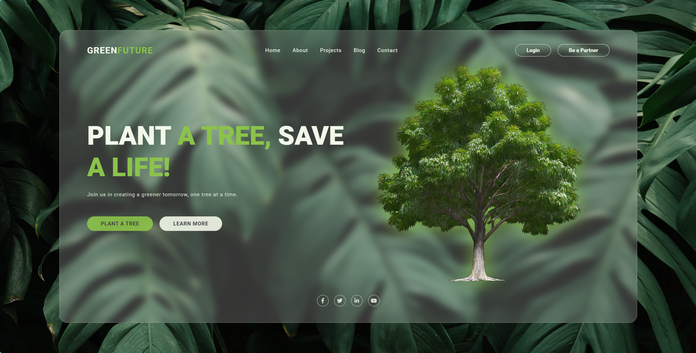

## 1.效果

主页面效果：

## 2.重要思想

**HTML 文件（index.html）**：用于定义页面结构，包含五个容器 `hero`, `about`, `project`, `contact`, `footer` 。

**CSS 文件（style.css）**：包含了页面的样式

**CSS 文件（animation.css）**：动画效果样式

**CSS 文件（responsive.css）**：响应式设计

## 3.实现步骤

1. 先布局每一个 `section`，再进行 `css` 的样式设计。`section-wrap` 为每个 `section` 共有的类，作用为设置一个共同的框大小。
2. 将各个元素设置到其所在的位置，之后进行动画效果编写
3. 每一个 `section` 编写完成后，根据页面大小编写响应式代码