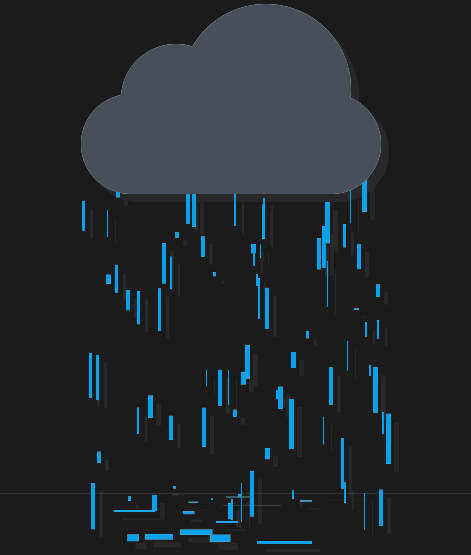

## 1.效果

## 2.重要思想

**HTML 文件（index.html）**：用于定义页面结构，包含一个容器 `.container` 和一个代表云的 `.cloud` 元素。通过 JavaScript 在 `.cloud` 元素内动态生成雨滴（`.drop`）。

**CSS 文件（main.css）**：包含了页面的样式和动画效果，具体包括：

- **整体页面布局**和**背景**设置
- **云层的动画效果**（通过 `@keyframes` 实现云层的闪烁效果）
- **雨滴的生成与下落动画**（通过 `@keyframes` 和 `animation` 控制）

**JavaScript 文件**：通过 `rain()` 函数动态创建雨滴，并使其在页面上生成、下落、消失。

## 3.实现步骤

### 页面布局

使用 `flex` 布局将 `.container` 居中显示，设置背景色为暗色调，模拟雨天环境。

### 云层动画

`.cloud`通过 `@keyframes` 设置闪烁效果，利用 `filter` 实现光晕变化，模拟云层的发光效果。

### 雨滴生成

使用 JavaScript 动态创建 `.drop` 元素，每个雨滴都随机设置位置、尺寸、动画持续时间等。

在页面上每隔一段时间生成新的雨滴，并将其添加到 `.cloud` 内部。

### 雨滴下落动画

通过 `@keyframes` 设置雨滴的下落动画，并使用 `scaleY` 模拟雨滴拉长的效果，增强动态感。

### 定时清除

设置定时器 `setTimeout` 删除已完成下落的雨滴元素，确保页面中不会积累过多 DOM 元素。